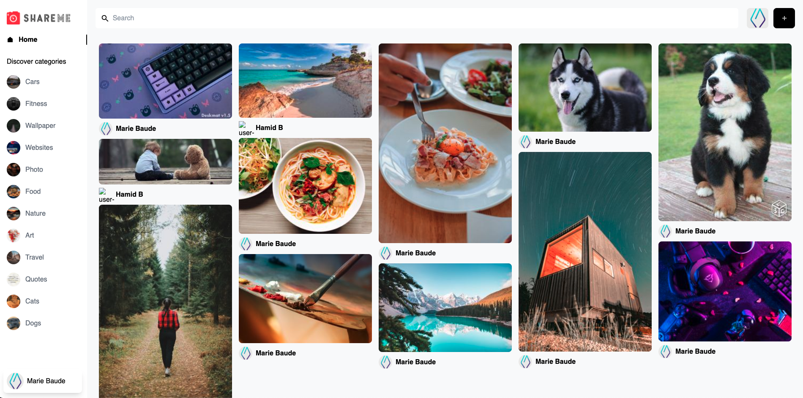

# Share me
Social media make with a tutoriel

### Make with ...
  Sanity

## The tutoriel
This project is a reproduction of the [tutoriel](https://www.youtube.com/watch?v=1RHDhtbqo94&list=WL&index=69&t=377s
) by JavaScript Mastery _alias_ [@adrianhajdin](https://github.com/adrianhajdin).

It's a small social network, with google authentication, pin creation, deletion and registration, containing an image and some information.
Search and filter are available.

## Installation

To test the project, you have to make a git clone or download the zip on your computer.
With the terminal, go to the project then to the 'front-end' section.

Execute command ``npm i`` in the terminal to install all dependencies.

## Versions
**Last version :** 1.0

## Authors
Project realized with :
* **Antonio Robles** _alias_ [@anto-d88](https://github.com/anto-d88)
* **Hamid Berkaine** _alias_ [@IdurarDev](https://github.com/IdurarDev)
* **Marie Baude** _alias_ [@MarieBaude](https://github.com/MarieBaude)
